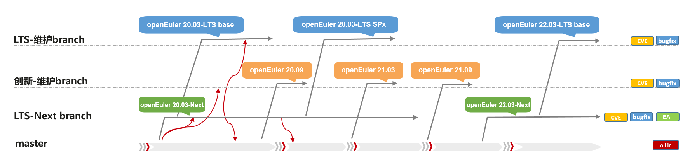
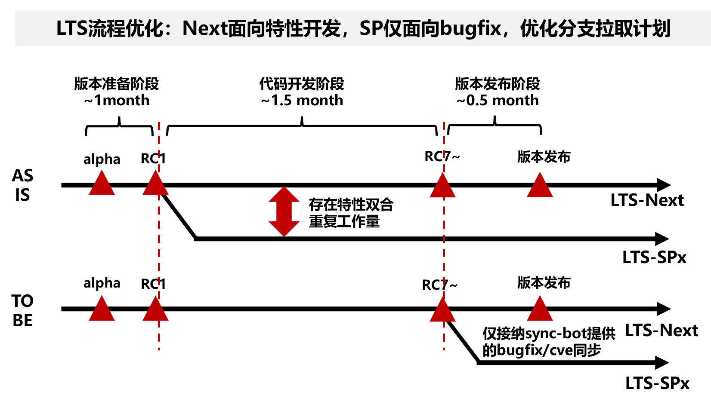

openEuler社区本着广泛合作，持续创新，包容并举的愿景，与所有开源软件世界的开发者共同持续打造稳定、创新的开源软件平台，构建支持多处理器架构、统一和开放的操作系统openEuler，推动软硬件生态繁荣发展。
在基于以上开源开放的理念的同时， openEuler遵从开源软件及版本分支管理规范，对每个版本分支确定明确且清晰的规范策略，本文档为社区维护人员介绍现有的openEuler社区各个分支中的软件包维护策略。如果有任何疑问或者需要澄清的地方，请您提交issue到[release-management SIG](https://gitcode.com/openeuler/release-management/issues)中进行讨论。

### master （主干分支）
master作为openEuler社区持续滚动开发的主干，积极接纳openEuler社区每个软件包主干开发分支的代码更新，将其纳入mainline主干实时构建，并基于该master主干构建每日版本推送给openEuler社区开发者使用。

对于master主干分支的软件包代码更新，openEuler社区开发者和维护者需要遵从基本规范：
* master主干推荐各个软件包维护者更新最新且稳定的版本，并基于[openEuler 创新版本的发布计划](https://gitcode.com/openeuler/release-management)，在创新版本**大规模构建**里程碑之前提供稳定且功能完善的版本，避免创新版本从master主干拉分支后，由于您的软件包版本问题导致必须回退到老版本，从而阻塞openEuler创新版本构建和发布；
* 避免提交明显会导致mainline主干构建失败的代码，如果本次PR会阻塞该软件包完整构建，建议单独拉额外分支提交；
* 当提交的代码更新PR明确包含ABI/API变更时，请您**提前一周（五个工作日）**提交ABI/API变更issue到[QA sig](https://gitcode.com/openeuler/QA/issues) 、[CI-bot sig](https://gitcode.com/openeuler/ci-bot/issues)，以便CI工程构建团队、QA测试团队及时更新对应的master主干工程基线列表和集成测试验证用例；
* 当提交的软件包代码更新影响master主干下多个软件包依赖更新（例如，所有perl，python，ruby或gcc软件包），请在你的PR中使用**buildsystem标签** ，同步请您**提前一周（五个工作日）**提交**系统构建**issue到[QA sig](https://gitcode.com/openeuler/QA/issues) 、[CI-bot sig](https://gitcode.com/openeuler/ci-bot/issues)，以便CI工程构建团队提供特定的EulerMaker构建分支，完成本次代码更新需要的大规模编译构建，该特性EulerMaker分支构建成功后，再同步PR到master主干，以此减少不确定代码更新导致master主干大范围软件包依赖关系的破坏；
* 如果某些软件包master分支需要回退到老版本，请确认已获得该软件包对应sig组例会及[openEuler TC委员会](https://gitcode.com/openeuler/community/tree/master/zh/technical-committee)批准，如果涉及底层关键软件包回退，包括（不限于）kernel、gcc、glibc，在获取[openEuler TC委员会](https://gitcode.com/openeuler/community/tree/master/zh/technical-committee)批准的同时，请务必确保你的回退变更早于openEuler创新版本需求收集冻结里程碑之前，以此减少对于master主干其他软件包和创新版本构建影响；

### 以openEuler 20.09创新版本分支为例 （创新版本分支）
openEuler社区创新版本分支按照**每6个月一个周期**从master主干分支拉出来，确定openEuler下一个创新版本(版本号命名规则：openEuler+年月的数字点分形式，例如：openEuler 20.09、openEuler 21.03、......)。该创新版本在经过集中编译、构建、Beta测试、release测试，并最终通过openEuler社区评审发布。

对于openEuler创新版本分支，社区开发者和维护者需要遵从基本规范：
* 创新版本分支拉出来前，请开发者确保自己维护的软件包master主干代码**稳定且可完整构建**；
* 创新版本分支拉出来后，原则上仅接受以patch形式合入的**少量补丁代码**，用于解决单点bug、安全漏洞、以及其他必须的适配修改，以此确保在版本发布之前该软件包持续处于稳定且可用的状态；
* 创新版本分支正式发布后，在保证软件包[ABI兼容规范](https://gitcode.com/openeuler/community/blob/master/zh/technical-committee/governance/software-management.md)的原则下，仅接受以patch形式合入的**少量补丁代码**，用于解决单点bug、安全漏洞、以及其他必须的适配修改，以此保证该版本维护周期内（默认维护周期为版本发布后的6个月内）的持续稳定性；
* 如有额外特殊新增特性、软件包调整变更，在获取[openEuler TC委员会](https://gitcode.com/openeuler/community/tree/master/zh/technical-committee)批准的同时，请您**提前一周（五个工作日）**提交变更issue到[release-management SIG](https://gitcode.com/openeuler/release-management/issues)、[QA sig](https://gitcode.com/openeuler/QA/issues) 、[CI-bot sig](https://gitcode.com/openeuler/ci-bot/issues)，以便release 版本发布团队、CI工程构建团队、QA测试团队及时更新对应的changeset信息及更新版本REPO软件仓库；

LTS版本分支管理&开发策略

### 以openEuler 20.03-LTS-NEXT 版本分支为例（长期支持维护版本开发分支）
openEuler LTS-NEXT分支作为该[LTS版本生命周期](https://www.openeuler.openatom.cn/zh/other/lifecycle/)时间内持续维护的**LTS版本开发主干**，LTS-NEXT开发主干**每12月一个周期**拉出来LTS-SPx版本分支，确定openEuler下一个LTS-SP版本(版本号命名规则：openEuler+年月的数字点分形式+LTS+SPx的数字形式，例如：openEuler 20.03-LTS SP1、openEuler 20.03-LTS SP2、......)。该LTS-SP版本在经过集中编译、构建、Beta测试、release测试，并最终通过openEuler社区评审发布。

对于openEuler LTS-NEXT开发版本分支，社区开发者和维护者需要遵从基本规范：

* LTS-NEXT开发版本主干分支在保证软件包[ABI兼容规范](https://gitcode.com/openeuler/community/blob/master/zh/technical-committee/governance/software-management.md)的原则下，并基于[openEuler LTS-SPx版本发布计划](https://gitcode.com/openeuler/release-management)，在LTS-SPx版本**大规模构建**里程碑之前提供稳定且功能完善的版本；
* 避免提交明显会导致LTS-NEXT主干构建失败的代码，如果本次PR会阻塞该软件包完整构建，建议单独拉额外分支提交；
* 当提交的代码更新PR明确包含ABI/API变更时，且与软件包[ABI兼容规范](https://gitcode.com/openeuler/community/blob/master/zh/technical-committee/governance/software-management.md)原则冲突的情况下，请您**提前一周（五个工作日）**提交ABI/API变更issue到[openEuler TC委员会](https://gitcode.com/openeuler/community/tree/master/zh/technical-committee)获取批准，同时请您提交**ABI/API变更**issue到[release-management SIG](https://gitcode.com/openeuler/release-management/issues)、[QA sig](https://gitcode.com/openeuler/QA/issues) 、[CI-bot sig](https://gitcode.com/openeuler/ci-bot/issues)，以便release 版本发布团队、CI工程构建团队、QA测试团队及时更新对应的changeset信息及更新版本REPO软件仓库；
* 如果某些软件包LTS-NEXT开发版本主干分支因某些特定原因需要回退到老版本，请确认已获得该软件包对应sig组例会及[openEuler TC委员会](https://gitcode.com/openeuler/community/tree/master/zh/technical-committee)批准，且务必确保你的回退变更早于openEuler LTX-SPx版本**需求收集冻结**里程碑之前，以此减少对于LTS-NEXT开发版本其他软件包和版本构建影响；
* LTS-Next分支定义为LTS的开发分支，所有的特性开发、bugfix/cve修复和软件选型升级，均要求在LTS-Next分支开发，然后按需同步至各LTS-SPx分支；

### 以openEuler 20.03-LTS版本分支为例（长期支持维护版本分支）
openEuler社区**LTS长期支持维护版本**按照**每48个月一个周期^①^**从master主干分支拉出对应**LTS版本开发主干**，由该开发主干拉出对应**LTS长期支持维护版本首版本**，确定openEuler下一个LTS长期支持维护版本(版本号命名规则：openEuler+年月的数字点分形式+LTS，例如：openEuler 20.03-LTS、openEuler 22.03-LTS、......)。该LTS版本在经过集中编译、构建、alpha版本测试、Beta版本测试、release版本测试，并最终通过openEuler社区评审发布。

对于openEuler LTS版本代码分支，社区开发者和维护者需要遵从基本规范：

* LTS版本分支拉出来前，请开发者确保自己维护的软件包master主干代码**稳定且可完整构建**；
* LTS版本分支拉出来后，原则上仅接受以patch形式合入的**少量补丁代码**，用于解决单点bug、安全漏洞、以及其他必须的适配修改，以此确保在版本发布之前该软件包持续处于稳定且可用的状态；
* LTS版本分支**正式发布后**，在保证软件包**ABI兼容**的原则下，仅接受以patch形式合入的**少量补丁代码**，用于解决单点bug、安全漏洞、以及其他必须的适配修改，以此保证该版本维护周期内（默认维护周期为版本发布后的24个月内）的持续稳定性；
* 如有额外特殊新增特性、软件包调整变更，在获取[openEuler TC委员会](https://gitcode.com/openeuler/community/tree/master/zh/technical-committee)批准的同时，请您**提前一周（五个工作日）**提交变更issue到[release-management SIG](https://gitcode.com/openeuler/release-management/issues)、[QA sig](https://gitcode.com/openeuler/QA/issues) 、[CI-bot sig](https://gitcode.com/openeuler/ci-bot/issues)，以便release 版本发布团队、CI工程构建团队、QA测试团队及时更新对应的
* LTS版本分支定位为稳定的版本维护分支，原则上仅接受LTS-Next已合入稳定代码的同步，即应该满足 LTS-Next软件版本 >= LTS软件版本

### 以openEuler 20.03-LTS/20.03-LTS-SP1版本分支为例（长期支持维护版本分支）
openEuler社区LTS-SP版本作为LTS基线版本生命周期内的次要发布版本，按照**每12个月一个周期^②^**从LTS-NEXT主干分支拉出来，确定openEuler下一个SP次要发布版本(版本号命名规则：openEuler+年月+LTS+SP的数字点分形式，例如：openEuler 20.03-LTS SP1、openEuler 20.03-LTS SP2、......)。该SP版本在经过集中编译、构建、Beta测试、release测试，并最终通过openEuler社区评审发布。

对于openEuler LTS SP版本分支，社区开发者和维护者需要遵从基本规范：

* LTS SPx版本分支拉出来前，请开发者确保自己维护的软件包LTS-NEXT主干代码**稳定且可完整构建**；
* LTS SPx版本分支拉出来后，原则上仅接受以patch形式合入的**少量补丁代码**，用于解决单点bug、安全漏洞、以及其他必须的适配修改，以此确保在版本发布之前该软件包持续处于稳定且可用的状态；
* LTS SPx版本分支**正式发布后**，在保证软件包**ABI兼容**的原则下，仅接受以patch形式合入的**少量补丁代码**，用于解决单点bug、安全漏洞、以及其他必须的适配修改，以此保证该版本维护周期内（默认维护周期为版本发布后的24个月内）的持续稳定性；
* 如有额外特殊新增特性、软件包调整变更，在获取[openEuler TC委员会](https://gitcode.com/openeuler/community/tree/master/zh/technical-committee)批准的同时，请您**提前一周（五个工作日）**提交变更issue到[release-management SIG](https://gitcode.com/openeuler/release-management/issues)、[QA sig](https://gitcode.com/openeuler/QA/issues) 、[CI-bot sig](https://gitcode.com/openeuler/ci-bot/issues)，以便release 版本发布团队、CI工程构建团队、QA测试团队及时更新对应的
* LTS-SP版本分支定位为稳定的版本维护分支，原则上仅接受LTS-Next已合入稳定代码的同步，即应该满足 LTS-Next软件版本 >= LTS-SPx软件版本 >= LTS-SPx-1软件版本 >=LTS软件版本

### 注释
① 自24.03 LTS版本起，LTS发布周期由~~24个月~~修改至**48个月**。即20.03 LTS/22.03 LTS两个历史版本发布周期为24个月，24.03 LTS及后续版本发布周期为48个月。生命周期与发布周期详见[openEuler版本生命周期](https://www.openeuler.openatom.cn/zh/other/lifecycle/)。
② LTS SP版本发布节奏规则如下：首LTS版本为3月发布(首版本视为大SP)，在发布周期内每年年底发布LTS SP版本(大SP)，在年中6月视社区需求可选增发LTS SP版本(小SP)。