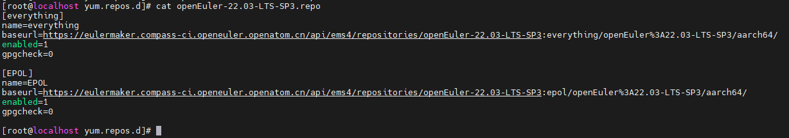

# CVE处理流程文档

## 一、CVE介绍

CVE全称为Common Vulnerabilities and Exposures，公共漏洞和暴露，又称通用漏洞披露、常见漏洞与披露，是一个与信息安全有关的数据库，收集各种信息安全弱点及漏洞并给予编号以便于公众查阅。此数据库现由美国非营利组织MITRE所属的National Cybersecurity FFRDC所营运维护。

CVE对每一个漏洞都赋予一个专属的编号，格式为CVE-YYYY-NNNN。其中YYYY为年份，NNNN为CVE的编号，例如CVE-2023-25950。

openEuler的CVE信息来源为NVD，NVD是一个美国政府基于安全内容自动化协议（SCAP）标准的漏洞管理数据的存储库，可实现漏洞管理、安全性度量和合规性的自动化。NVD的官方网址为https://nvd.nist.gov/。

漏洞严重程度通常通过CVSS来衡量，CVSS是一个开放框架，用于传达软件漏洞的特征和严重性。CVSS由三个度量标准组组成：基础，时间和环境。基本指标产生的分数介于0到10之间，然后可以通过对时间和环境指标进行评分来进行修改。openEuler根据CVSS评分将漏洞严重程度分为四个等级：严重为9分以上，主要为7.0–8.9分，次要为4.0 – 6.9，不重要为0.1 – 3.9。

openEuler安全委员会（Security Committee, SC）过接收和响应openEuler产品安全问题报告、提供社区安全指导，开展安全治理等活动提升社区产品的安全性。SC在openEuler社区官网发布了漏洞管理策略，包括如何上报安全问题、获取SA和安全补丁等信息，详见 https://openeuler.org/zh/security/vulnerability-reporting/

CVE处理流程图：


以CVE-2023-25950为例，issue链接：https://gitee.com/src-openeuler/haproxy/issues/I6UTNX

## 二、分析CVE

### 2.1 通过网络搜索CVE，获取漏洞信息 

### 2.2 分析受影响情况

1、 通过网络搜索CVE号，获取漏洞相关信息。

漏洞描述：HAProxy 版本 2.7.0 和 2.6.1 至 2.6.7 中的 HTTP 请求/响应走私漏洞允许远程攻击者更改合法用户的请求。因此，攻击者可能会获取敏感信息或导致拒绝服务 （DoS） 条件。

2、分析影响

具体影响：HAProxy的HTTP/3实现无法阻止格式错误的HTTP标头字段名称，当部署在错误处理此格式错误标头的服务器前时，它可能会被用来进行HTTP请求/响应走私攻击。远程攻击者可以更改合法用户的请求。因此，攻击者可能会获取敏感信息或导致拒绝服务（DoS）情况。

影响范围：haproxy 2.7.0、2.6.1至2.6.7版本。

分析结论：当前openEuler社区haproxy的发布版本分别为2.2.16、2.4.8及2.6.6版本，根据漏洞描述信息可知仅2.6.6版本的分支受此漏洞影响。

### 2.3 受影响修复情况

#### 2.3.1 通过gitee确认

可登录码云，切换到对应分支，查看spec及补丁，确定是否已修复

码云：https://gitee.com/src-openeuler/haproxy


#### 2.3.2 通过obs或eulermaker确认

2.3.2.1 通过Eulermaker确认 （当前在Eulermaker平台构建软件包）

1）登录地址：https://eulermaker.compass-ci.openeuler.openatom.cn/projects 

2）默认为“公有工程”，在右侧搜索框中快速搜索对应分支，查找对应软件包，如下所示：


3）进入软件包，在“下载“页面找到对应架构的src.rpm包，在右侧”下载“字段单击鼠标右键复制下载链接;

4）进入本地虚拟机环境，使用”wget  xxx.src.rpm下载地址“ 将源代码下载到本地，再通过“rpm2cpio haproxy-xxx.src.rpm | cpio -id”，解压源码后查看补丁，确定是否已修复。CVE已在当前版本修复，如下所示：


2.3.2.2 通过obs确认 （OBS平台已下线）

登录OBS或EBS网页查看haproxy的spec及对应的补丁，确定是否已修复

OBS：https://build.openeuler.openatom.cn/project


#### 2.3.3 查看源码，进行二次确认

进一步分析打上所有补丁之后的源码，防止后续的提交revert了之前修复CVE的补丁。


## 三、未修复，查找补丁修复

### 3.1 查找补丁

1、通过NVD网站查找补丁： https://nvd.nist.gov/vuln/detail/CVE-2023-25950


2、通过github平台直接查找CVE或者根据漏洞影响的文件查找补丁： https://github.com/haproxy/haproxy

https://github.com/haproxy/haproxy/commit/3ca4223c5e1f18a19dc93b0b09ffdbd295554d46

https://github.com/haproxy/haproxy/commit/d6fb7a0e0f3a79afa1f4b6fc7b62053c3955dc4a

3、通过官网查找补丁信息： https://www.haproxy.org/

### 3.2 补丁验证

1、本地环境验证patch是否可以正常回合

根据上述查找补丁的方式，可确定补丁链接为：https://git.haproxy.org/?p=haproxy-2.7.git;a=commit;h=3ca4223c5e1f18a19dc93b0b09ffdbd295554d46

下载补丁到本地环境：


1）下载haproxy-2.6.6版本代码： git clone https://gitee.com/src-openeuler/haproxy

2） 切换到要验证的分支：git checkout -b openEuler-22.03-LTS-SP1

3） 创建本地rpmbuild目录：mkdir ~/rpmbuild/SOURCES –p

4） 复制对应分支下的文件到SOURCES目录下：cp * ~/rpmbuild/SOURCES

5） 切换到SOURCES目录下：cd ~/rpmbuild/SOURCES

6） 打入历史回合的patch：rpmbuild -bp haproxy.spec

7） 进入rpmbuild/BUILD/haproxy源码目录下验证修复补丁： patch -p1 < 补丁路径


由图知补丁修改的两处位置仅有行差，可正常回合。 

2、Eulermaker平台验证编译和安装

1）验证编译：

- 参考1步骤，确保修复补丁可以直接回合进源码

- 将gitee平台的src-openeuler/haproxy 仓库fork到个人仓库


-  将远程 fork的haproxy仓库clone到本地环境

​       git clone https://gitee.com/starlet-dx/haproxy.git

- 进入本地clone下来的haproxy目录，切换到需要提交的分支

​       git checkout -b openEuler-22.03-LTS-SP3

- 将修改验证后的CVE修复补丁拷贝到当前目录下，并在spec中添加补丁声明并确保执行了打patch的操作，见：


**由于该包spec的%prep阶段使用了%autosetup，无需在此阶段执行打补丁的操作，补丁就会自动被读取并打上**

- 之后执行“git add -A & git commit -m ’提交信息‘ ”命令，将修改后的代码上传gitee个人仓库下

- 从Eulermaker对应工程haproxy的“软件包详情”页面，点击“软件包继承”，即可将haproxy拉取到个人工程


- 进入haproxy软件包页面，编辑"git地址"，修改为个人仓库软件包地址，见：


- 点击“开始构建”，构建软件包，见：


- 构建成功，则编译通过。（若构建失败，可点击“查看”按钮浏览构建日志报错）


2）验证安装：

1）参考[EulerMaker用户指南.html#基于命令行](https://docs.openeuler.org/zh/docs/22.03_LTS_SP4/docs/EulerMaker/EulerMaker%E7%94%A8%E6%88%B7%E6%8C%87%E5%8D%97.html#%E5%9F%BA%E4%BA%8E%E5%91%BD%E4%BB%A4%E8%A1%8C%E8%BF%9B%E8%A1%8C%E6%9E%84%E5%BB%BA)进行构建，熟悉ccb命令的配置及基本操作

2）使用"ccb download" 命令，下载编译出的二进制rpm包到本地环境，如下所示：


3）配置工程repo，用工程源为安装测试做准备。配置步骤如下所示：




4）进入下载好的目录，安装二进制子包。安装成功，如下所示：


```
EulerMaker用户指南：
https://docs.openeuler.org/zh/docs/22.03_LTS_SP4/docs/EulerMaker/EulerMaker%E7%94%A8%E6%88%B7%E6%8C%87%E5%8D%97.html
```

2、OBS验证编译和安装 （OBS平台已下线）

1）找到要构建的包所在的工程，搜索该软件包，并单击“branch package”将公有工程的包拉到个人工程；


2）在本地环境，将个人工程的该软件包以“osc co”的方式拉取下来：


3）进入软件包目录，存在一个_service文件，使用osc up –S拉取代码，再删除_service文件及其他文件的多余前缀（_service直接获取git源码）


4）将修复CVE的补丁拷贝到当前目录下，在spec中添加补丁声明并确保执行了打patch的操作（参考上述Eulermaker中spec修改）

5） 执行osc addremove & osc update & osc commit ，将修改后的代码上传到OBS个人工程软件包下

6） 软件包代码更新，OBS重新分配worker触发编译，出现building就开始构建了；

7） 软件包编译成功，可点击”standard_aarch64”或“standard_x86_64”，查看编出的二进制包和源码包。点击“Details”即可查看二进制包提供的模块和安装依赖情况。


8） 通过“Provided by”列可以判断安装是否缺依赖。若该列为空，则表示安装缺依赖，需解决缺依赖情况后再提交修复。


```
OBS构建软件包参考以下教程链接：

- 注册OBS及配置：https://forum.openeuler.org/t/topic/868

- 使用OBS构建软件包：https://forum.openeuler.org/t/topic/875

- 构建RPM指导：https://docs.openeuler.org/zh/docs/23.03/docs/ApplicationDev/构建RPM包.html
```

3、gitee门禁验证编译安装（待提交pr后可再次通过门禁状态判断编译、安装情况）


### 3.3 提交pr修复

1、首先，需要将gitee平台的src-openeuler/haproxy 仓库fork到个人仓库


2、将远程 fork的haproxy仓库clone到本地环境

git clone https://gitee.com/starlet-dx/haproxy.git

3、本地环境拉取需要提交pr的分支

git checkout -b openEuler-22.03-LTS-SP1

4、修改验证后的补丁和spec到haproxy的目录下

git add -A & git commit -m “Fix CVE-2023-25950”

5、推送到码云的个人仓库对应分支： git push

6、在个人仓库点击“+pull request”按钮进入创建PR页面。


7、提交PR时，标题一般与changelog一致，说明里需要贴上CVE的issue链接、补丁链接，然后点击“创建 pull request”按钮创建PR。


8、需关注“提交记录”和“文件改动”状态。若存在多条提交记录，需合并成一条；若文件改动跟实际修改存在差异，本地修改后重新提交到个人仓库，再创建提交pr。

9、Pr提交后，关注门禁构建结果。若出现报错情况，需确认是否提交存在问题，针对报错现象进行修改；若门禁报错属于正常构建结果，需在评论区解释报错原因，方便maintainer检视。

10、门禁编译通过，出现“ci_successful”标签且无门禁报错后，添加“审查人员”后等待代码合入。

11、跟踪pr直到出现“已合入”标签，则说明此CVE的修复patch已回合到最新代码仓库，完成修复。


```
gitee参考文档：

- 注册gitee帐号帮助文档：https://gitee.com/help/articles/4113#article-header0

- 签署CLA指导文档：https://gitee.com/openeuler/infrastructure/blob/master/docs/cla-guide/faq/faq.md

- 提交Pr指导说明文档：https://gitee.com/openeuler/community/blob/master/zh/contributors/Gitee-workflow.md
```

### 3.4 适配补丁修复

上游社区提供的修复补丁无法直接回合，而补丁修改位置前后代码行无较大变更或补丁修改的文件目录存在变化，可考虑适配补丁。

示例一：适配补丁文件的目录

https://gitee.com/src-openeuler/mysql/pulls/99/files

示例二：适配补丁文件的上下文内容（CVE-2023-28708.patch）

https://gitee.com/src-openeuler/tomcat/pulls/90/files

```
适配补丁步骤：

1、初始化git仓： git init

2、添加当前git仓： git add -A

3、将初始化的git仓作为一次提交： git commit -m “init”

4、在源码目录下修改对应补丁文件的内容，修改完成后保存退出

5、再次添加修改后的git仓： git add -A

6、再次将修改后的git仓进行提交： git commit -m “Fix CVE-YYYY-XXXX”

7、将上次的提交生成patch： git format-patch -n1

8、修改patch的commit信息，将上游补丁链接地址作为origin添加到commit信息中
```

### 3.5 需要查找前置补丁

上游社区提供的修复补丁无法直接回合，而补丁修改的文件函数名、参数和方法名等存在较大差异，无法适配补丁时，可考虑查找前置补丁。

怎样查找前置补丁？

以当前修复补丁的commit信息和补丁修改内容为参考，从上游社区的代码仓库提交记录中进行查找。

示例：https://gitee.com/src-openeuler/tomcat/pulls/90/files

### 3.6 特殊情况修复（仅限高分CVE）

以“CVE-2022-25235, CVE-2022-25236 and CVE-2022-25315”为例，issue链接：

CVE-2022-25235：https://gitee.com/src-openeuler/firefox/issues/I4Y5XF

CVE-2022-25236：https://gitee.com/src-openeuler/firefox/issues/I4Y7SA

CVE-2022-25315：https://gitee.com/src-openeuler/firefox/issues/I4Y7UU

即：漏洞实际发生在expat软件包中，但由于firefox中打包了expat的源码，故firefox也涉及此漏洞，需要在firefox中提交修复。

修复pr链接：https://gitee.com/src-openeuler/firefox/pulls/50/files


**patch回合指导文档，参考如下：**

patch回合指导：[patch回合指导](http://gitee.com/cherry530/doc/blob/master/patch回合相关指导.md)

patch回合checklist，如下所示：

| 场景   | 相关步骤说明 | 检查项                                                       | 是否有门禁拦截 | 备注 |
| ------ | ------------ | ------------------------------------------------------------ | -------------- | ---- |
| 打补丁  | 自验证      | 1、CVE的补丁，补丁以CVE-编号命名     <br />2、参考上游的补丁，标注补丁来源链接     <br />3、spec中需关注prep阶段是否为自动回合方式，确保patch打入     <br />4、适配的补丁与原补丁文件对比是否有缺失，错改情况，并在补丁commit信息中标注参考链接地址     <br />5、版本跨度较大的补丁，需关注高低版本补丁代码逻辑是否合理且一致，再考虑能否进行适配     <br />6、本地验证patch是否生效 | 否             |      |


## 四、未修复，升级修复

### 4.1 无修复补丁升级

若上游社区或NVD未提供修复补丁，但明确在哪个版本修复此CVE，可升级到修复版本解决

参考《软件包升级流程文档》升级

[软件包升级流程](https://gitee.com/cherry530/doc/blob/master/软件包升级流程.md)

### 4.2 有修复补丁升级

若NVD、上游社区或其他社区提供的补丁与当前社区版本代码差异过大，无法适配，可以尝试通过升级软件包修复

① 确认升级后的版本已合入修复CVE的补丁

② 参考《软件包升级流程文档》进行升级

  [软件包升级流程](https://gitee.com/cherry530/doc/blob/master/软件包升级流程.md)

**注意事项：**

⑴ 升级具体注意事项如下：

| 场景 | 相关步骤说明 | 检查项                                                       | 是否有门禁拦截                                               | 备注 |
| ---- | ------------ | ------------------------------------------------------------ | ------------------------------------------------------------ | ---- |
| 升级 | 升级分析     | 1、软件兼容性等级是否允许进行升级     <br />2、L3 软件升级影响检查， 检查项建议参考euleros list | NA                                                           |      |
| 升级 | 自验证       | 1、升级后是否编译成功     <br />2、升级后是否安装卸载成功     <br />3、升级后一级上层依赖包是否编译成功     <br />4、升级后一级上层依赖包是否安装成功     <br />5、升降级验证：环境升降级成功 ；验证失败检查项：spec Obsolete、Provides、Requires    <br />6、升级后命令是否执行成功     <br />7、升级后服务是否启动停止成功    <br />8、升级后的url是否可访问且上游无废弃说明     <br />9、升级后的每个source必须有上游来源且可访问     <br />10、tar包是否从source0下载的，两者md5值是否一致     <br />11、升级后软件包的license是否合规     <br />12、升级时若删除patch，确认patch是否合入到高版本源码中     <br />13、升级后version变更，release从1开始，release不需要加%{?dist}     <br />14、升级后若子包数量变更，确认变更子包是否会影响基础镜像制作 | 是<br/>是<br/>否<br/>否<br/>否<br/><br />否<br/>否<br/>否<br/>否<br/>是<br/>是<br/>否<br/>否<br/>否 |      |

⑵ 若升级到修复版本，出现编译、安装或需引入大量依赖包等无法解决的问题，可遗留挂起

⑶ 已发布且维护中的版本，若必须通过升级来修复CVE，需参考对应组件的兼容性等级，排查影响范围，影响范围广（level2及以上）的则不能升级，对应CVE可遗留挂起

兼容性等级链接：

https://gitee.com/openeuler/oec-application/blob/master/doc/compatibility_level.md

⑷ 已发布且维护中的版本，若升级解决CVE造成对上层依赖包的编译安装有影响，需分析以下几点：

ⅰ 需跟对应软件包的committer或maintainer达成一致，是否能打补丁或升级解决上层依赖包的编译安装问题

ⅱ 上层依赖包被影响需升级解决，需要查看该包的兼容性等级，根据兼容性等级决策是否升级

ⅲ 由于上层依赖包被影响需升级，因为兼容性问题又无法升级的，此CVE可遗留挂起

## 五、未修复，需要遗留挂起

### 5.1  在研版本，需安全委员会评审裁决

CVE无法通过补丁或升级修复，但issue关联了在研版本的里程碑，这种情况下需梳理CVE遗留备案材料，找安全委员会的人组织会议，上会评审。会议同意遗留后，再挂起issue

CVE备案材料需要关注以下几点：

①受影响分析（需要阐述这个CVE的触发场景，是否对系统可用性，安全性，机密性等造成影响）

②报备原因（上游社区及其他平台的修复策略是什么，openEuler为什么无法修复，当前的难点或风险是什么）

③如果遗留了准备什么时候处理该CVE，是否有相应的计划

### 5.2  维护版本，无需评审裁决

CVE在已发布版本分支无法通过补丁或升级方案修复，需在issue中明确阐述当前的修复难点和阻塞修复的原因，逻辑清晰，有事实举证，理由充足即可遗留挂起。

CVE遗留挂起常见场景示例：

①上游社区无修复补丁，无法通过CVE的描述定位到漏洞相关的代码行

②上游社区披露的漏洞触发场景，无法分析当前社区使用过程中是否会涉及

③CVE的各发布网站评分低，影响可控，且各友商都无修复方案

④上游社区有修复补丁，但未合入到发布版本，即补丁仍存在争议

⑤升级修复CVE，升级到修复版本，出现编译、安装或需引入大量依赖包等无法解决的问题

## 六、不受影响

### 6.1  基线版本已修复

基线版本：系统版本发布时的软件版本，一般指source、everything repo源中软件的版本

以“CVE-2015-8863”为例，该漏洞影响1.5及之前版本的jq，1.6版本已修复此漏洞，当前社区22.03-LTS、22.03-LTS-SP1分支为1.6版本，20.03-LTS-SP1、20.03-LTS-SP3分支为1.5版本，该分支初始化代码仓时已回合该漏洞修复补丁，故不受影响

issue链接：https://gitee.com/src-openeuler/jq/issues/I7BARM

基线版本repo：

20.03-LTS-SP1：https://repo.openeuler.org/openEuler-20.03-LTS-SP1/source/Packages/

20.03-LTS-SP3：https://repo.openeuler.org/openEuler-20.03-LTS-SP3/source/Packages/

22.03-LTS：https://repo.openeuler.org/openEuler-22.03-LTS/source/Packages/

22.03-LTS-SP1：https://repo.openeuler.org/openEuler-22.03-LTS-SP1/source/Packages/

### 6.2  分支版本不涉及

以“CVE-2022-31156”为例，该漏洞影响6.2 至 7.4.2版本的gradle，在6.2版本中引入该问题，需要升级至7.5版本才可以修复此漏洞。当前gradle是4.4.1版本，不在漏洞影响范围内，故不受影响

issue链接：https://gitee.com/src-openeuler/gradle/issues/I6S7QB

### 6.3  CVE关联软件包有误

可以根据CVE相关描述、NVD里CPE标注组件以及修复该CVE对应的上游社区补丁链接仓库地址等进行判断。

①以“CVE-2023-28856”为例，issue链接：https://gitee.com/src-openeuler/python-redis/issues/I6WI59

②以“CVE-2023-28399”为例，issue链接：https://gitee.com/src-openeuler/acl/issues/I79Z2Q

## 七、关闭issue

### 7.1 不受影响的CVE

在Issue中评论不受影响原因及影响分析后，关闭issue。如下所示：

1）分析不受影响原因，进行评论：


2）引用模板进行影响分析评论：


### 7.2 受影响的CVE

#### 7.2.1 所有版本受影响

所有受影响分析的pr合入后，在issue中评论影响分析，关闭issue。

#### 7.2.2 仅基线版本受影响，最新版本不受影响

需要联系社区管理员关联issue到修复pr中，在issue中评论影响分析为受影响，关闭issue。

```
issue指导链接：
https://gitee.com/openeuler/cve-manager/blob/master/cve-vulner-manager/doc/md/manual.md
```

## 八、CVE复盘

### 8.1 版本升级导致漏洞影响性变化

① 软件包升级后，原本不受漏洞影响的版本的变成了受影响版本，社区需重新扫描该包的CVE（待实现功能）

② 由于非CVE原因导致软件包升级，针对历史挂起的CVE，需重新评估升级后的版本是否已修复

### 8.2 历史挂起CVE需定时复盘上游的修复情况

历史挂起的CVE每三个月核查一次，重新排查上游是否已修复或社区当前版本是否仍涉及

NVD及上游社区明确漏洞的受影响范围，社区当前版本在漏洞影响的临界版本，若开发人员定位为不受影响，需要在issue中详细阐述不受此漏洞影响的具体原因。
