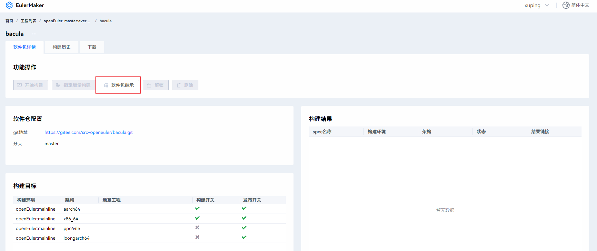
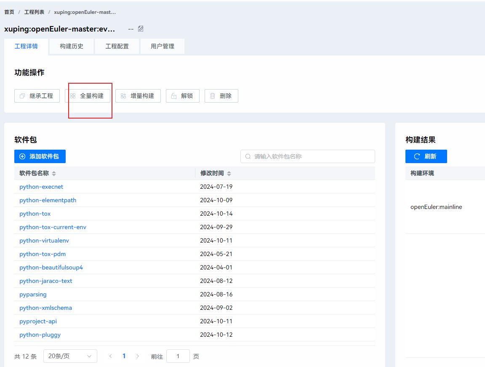

# **软件包升级流程**

## 一、升级选型

```
请阅读openEuler社区软件包选项原则，确认升级后的版本是否符合选型原则,
社区的升级选项主要分为创新版本和稳定版本:
https://gitee.com/openeuler/community/blob/master/zh/technical-committee/governance/software-management.md#%E8%BD%AF%E4%BB%B6%E9%80%89%E5%9E%8B%E5%8E%9F%E5%88%99
```

升级选型检查项
| 场景   | 相关步骤说明 | 检查项                                                       | 是否有门禁拦截 | 备注 |
| ------ | ------------ | ------------------------------------------------------------ | -------------- | ---- |
| 升级  | 升级分析      | 1. 软件兼容性等级是否允许进行升级   <br />2. L3软件升级影响检查     | NA             | 软件兼容性等级参见: https://gitee.com/openeuler/oec-application/blob/master/doc/compatibility_level.md <br /> 检查项建议参考: https://gitee.com/src-openeuler/freemarker/issues/I5AKEJ?from=project-issue    |

## 二、升级验证

### 2.1  升级前准备

1、根据spec文件的url source等字段，查找该软件包的上游地址，下载上游最新稳定版本源码包。

2、修改spec中相关字段：

    1）修改source字段，修改为新源码包的下载地址
    
    2）version字段：修改为升级后的版本号；release字段：升级场景置为1
    
    3）%prep阶段，解压tar包时尽量使用模块名和版本号的宏进行替换
    
    4）%build、%install、%check及%files阶段，根据编译过程做相应修改
    
    5）增加changlog描述，包含日期、邮箱、版本号、修改内容简要说明等

3、若存在patch文件，需排查patch文件内容是否在高版本已修复
   ```
   判断方法：
   a)获取上游自我们版本后到最新需要升级版本的所有commit
     git clone XXX.git
     cd XXX
     git log --pretty=oneline tagA...tagB
   b)比对目前社区中补丁的commit是否在上述获取的列表中
     在：即已修复，不在：需要人工判断是否是代码优化了，还是没有修复
   处理策略：
    1）若已修复，则删除该patch文件及spec中打入该patch的相关信息
    2）若未修复，则patch内容与升级后的源码包内容存在上下文差异，需在上游社区排查该patch内容的上下文是否被重构或是否有适配高版本的patch可代替
   ```
4、升级前准备检查项

| 场景   | 相关步骤说明 | 检查项                                                       | 是否有门禁拦截 | 备注 |
| ------ | ------------ | ------------------------------------------------------------ | -------------- | ---- |
| 升级  | 自验证      | 1. 升级后的url是否可访问且上游无废弃说明   <br />2. 升级后的每个source必须有上游来源且可访问     <br />3. tar包是否从source0下载的，两者md5值是否一致     <br />4. 升级时若删除patch，确认patch是否合入到高版本源码中     <br />5. 升级后version变更，release从1开始，release不需要加%{?dist}     <br />6.升级后若删除子包，请确认删除的子包是否会影响基础镜像制作(在src-openeuler/oemaker仓库里搜索包名进行确认) |否<br />否<br />是<br />否<br />否<br />否<br /><br />    |      |

### 2.2 升级后的编译安装

初步修改完spec和替换源码包后，可本地验证编译安装

```
yum install 你编译出来的包
```

#### 2.2.1 本地编译

```
方式一、osc build --clean 进行编译
具体当时参见：
https://gitee.com/openeuler/docs/blob/master/docs/zh/docs/ApplicationDev/%E6%9E%84%E5%BB%BARPM%E5%8C%85.md#%E4%BD%BF%E7%94%A8obs%E6%9E%84%E5%BB%BA

方式二、本地rpmbuild -ba xx.spec进行编译
具体方式参见：
https://gitee.com/openeuler/docs/blob/master/docs/zh/docs/ApplicationDev/%E6%9E%84%E5%BB%BARPM%E5%8C%85.md#%E6%9C%AC%E5%9C%B0%E6%9E%84%E5%BB%BA

```
#### 2.2.2 EulerMaker编译

EulerMaker主页地址：https://eulermaker.compass-ci.openeuler.openatom.cn/projects

```
以这个举例：升级master:everything分支的bacula，可将bacula从master:everything分支到个人工程进行修改验证
```
1）根据要升级的分支，找到对应的EulerMake工程


2）继承到自己的个人工程中

工程中搜索自己需要验证的包


点击软件包继承



更改自己需要继承到的工程地址，更改后点击确认


3）更改个人工程中的包的分支和仓库地址【点击编辑按钮】

点击如下俩红框可以更改自己提交到码云个人仓库的包和分支


4）进行构建【点击开始构建】


```
注：以上均可参考EulerMaker的操作文档https://docs.openeuler.org/zh/docs/22.03_LTS_SP4/docs/EulerMaker/EulerMaker%E7%94%A8%E6%88%B7%E6%8C%87%E5%8D%97.html
```
#### 2.2.3 obs编译【obs已不再继续使用】

obs主页地址：https://build.openeuler.openatom.cn/project

```
根据要升级的分支，基于对应的obs工程验证，如待升级openEuler:Mainline分支的python-aiohttp，可将python-aiohttp从openEuler:Mainline分支到个人工程进行修改验证

OBS构建软件包可以参考以下教程链接：
1）注册OBS及配置
https://forum.openeuler.org/t/topic/868
2）使用OBS构建软件包
https://forum.openeuler.org/t/topic/875
3）构建RPM指导
https://gitee.com/openeuler/docs/blob/master/docs/zh/docs/ApplicationDev/%E6%9E%84%E5%BB%BARPM%E5%8C%85.md
```
#### 2.2.4 解决编译报错

1、可根据报错日志定位到spec中的某个阶段，排查为spec原因还是源码原因

2、可在上游社区搜索报错日志，如github，寻找是否有相关补丁

3、可参考友商发布版本，寻找是否有相关补丁

4、可在社区quickissue页面搜索关键词，查找是否有历史构建问题：https://quickissue.openeuler.org/zh/issues/

5、参考社区解决构建失败案例，如下：
```
python语言类
https://gitee.com/src-openeuler/python-qt5/issues/I4VYI1
https://gitee.com/src-openeuler/python-parse_type/issues/I4PQ27
https://gitee.com/src-openeuler/python-genshi/issues/I4PO6J

ruby语言类
https://gitee.com/src-openeuler/rubygem-sqlite3/issues/I5ZZAH
https://gitee.com/src-openeuler/rubygem-activesupport/issues/I5FJVP
https://gitee.com/src-openeuler/rubygem-tilt/issues/I2B8SM

perl语言类 
https://gitee.com/src-openeuler/perl-Pod-Usage/issues/I42T4Q
https://gitee.com/src-openeuler/perl-Clone/issues/I4844Q
https://gitee.com/src-openeuler/perl-Unicode-LineBreak/issues/I4ATV4

C语言类
https://gitee.com/src-openeuler/utf8proc/issues/I4FF7P
https://gitee.com/src-openeuler/libnma/issues/I5CSHH
https://gitee.com/src-openeuler/clevis/issues/I6FUZZ

java语言类
https://gitee.com/src-openeuler/mxparser/issues/I41SNN
https://gitee.com/src-openeuler/javapackages-tools/issues/I4N4RW
https://gitee.com/src-openeuler/openwebbeans/issues/I7AT0S

nodejs语言类
https://gitee.com/src-openeuler/nodejs/issues/I6CN33
https://gitee.com/src-openeuler/nodeis-hash_file/issues/I6E8IG
https://gitee.com/src-openeuler/nodejs-colors/issues/I630SL

```

#### 2.2.5 升级安装卸载验证

1、根据升级的目的分支，选择对应的环境验证安装卸载

 1）master分支升级，可选择最近一次的创新版本环境验证安装卸载

 2）LTS版本升级，选择对应的LTS环境验证安装卸载

#### 2.2.6 升级后的编译安装检查项

| 场景   | 相关步骤说明 | 检查项                                                       | 是否有门禁拦截 | 备注 |
| ------ | ------------ | ------------------------------------------------------------ | -------------- | ---- |
| 升级 | 自验证      | 1.升级后是否编译成功     <br />2.升级后是否安装卸载成功      | 是  <br />是           |      |


### 2.3 上层依赖包的编译安装验证

1、根据升级的目的分支，找到该包的上层依赖包

```
可通过如下命令查找某个软件包及其子包的上层依赖包：
rpm -qp --provides xxx.rpm | awk '{print $1}' | for line in `xargs`; do dnf repoquery --whatrequires "$line" ;done
要根据升级的目的分支，配置对应分支的repo，来运行上述命令识别上层依赖
如：在master分支升级，配置22.03-LTS分支的repo来识别某个包的上层依赖包，此举会造成误差
```

 2、各分支的ebs repo源

```
master分支的ebs repo源：
[everything]
name=everything
baseurl=https://eulermaker.compass-ci.openeuler.openatom.cn/api/ems4/repositories/openEuler-master:everything/openEuler%3Amainline/aarch64/
enabled=1
gpgcheck=0

[epol]
name=epol
baseurl=https://eulermaker.compass-ci.openeuler.openatom.cn/api/ems4/repositories/openEuler-master:epol/openEuler%3Amainline/aarch64/
enabled=1
gpgcheck=0

[factory]
name=factory
baseurl=https://eulermaker.compass-ci.openeuler.openatom.cn/api/ems4/repositories/openEuler-master:factory/openEuler%3Amainline/aarch64/
enabled=1
gpgcheck=0
```

```
维护版本的ebs repo源
openEuler:22.03:LTS:SP1:
https://eulermaker.compass-ci.openeuler.openatom.cn/api/ems1/repositories/openEuler-22.03-LTS-SP1:everything/openEuler%3A22.03-LTS-Next/aarch64/
https://eulermaker.compass-ci.openeuler.openatom.cn/api/ems1/repositories/openEuler-22.03-LTS-SP1:epol/openEuler%3A22.03-LTS-Next/aarch64/

openEuler:22.03:LTS:SP3:
https://eulermaker.compass-ci.openeuler.openatom.cn/api/ems4/repositories/openEuler-22.03-LTS-SP3:everything/openEuler%3A22.03-LTS-SP3/aarch64/
https://eulermaker.compass-ci.openeuler.openatom.cn/api/ems4/repositories/openEuler-22.03-LTS-SP3:epol/openEuler%3A22.03-LTS-SP3/aarch64/

openEuler:22.03:LTS:SP4:
https://eulermaker.compass-ci.openeuler.openatom.cn/api/ems5/repositories/openEuler-22.03-LTS-SP4:everything/openEuler%3A22.03-LTS-SP4/aarch64/
https://eulermaker.compass-ci.openeuler.openatom.cn/api/ems5/repositories/openEuler-22.03-LTS-SP4:epol/openEuler%3A22.03-LTS-SP4/aarch64/

openEuler:20.03:LTS:SP4:
https://eulermaker.compass-ci.openeuler.openatom.cn/api/ems3/repositories/openEuler-20.03-LTS-SP4:everything/openEuler%3A20.03-LTS-SP4/aarch64/
https://eulermaker.compass-ci.openeuler.openatom.cn/api/ems3/repositories/openEuler-20.03-LTS-SP4:epol/openEuler%3A20.03-LTS-SP4/aarch64/

openEuler:24.03:LTS：
https://eulermaker.compass-ci.openeuler.openatom.cn/api/ems2/repositories/openEuler-24.03-LTS:everything/openEuler%3A24.03-LTS/aarch64/
https://eulermaker.compass-ci.openeuler.openatom.cn/api/ems2/repositories/openEuler-24.03-LTS:epol/openEuler%3A24.03-LTS/aarch64/
```

```
24.03-LTS-Next的 ebs repo源：
https://eulermaker.compass-ci.openeuler.openatom.cn/api/ems3/repositories/openEuler-24.03-LTS-Next:everything/openEuler%3A24.03-LTS-Next/aarch64/
https://eulermaker.compass-ci.openeuler.openatom.cn/api/ems3/repositories/openEuler-24.03-LTS-Next:epol/openEuler%3A24.03-LTS-Next/aarch64/
```

```
维护版本正式发布repo 源：
https://repo.openeuler.org/
在该链接下找对应的版本分支
```

以上关于ebs源的获取方法，可以在ebs的工程列表中找到对应所需的工程
搜索对应的工程


获取源点击进去搜索到的工程->然后点击前往下载repo源->然后找自己需要架构的repo进行配置


3、将上层依赖包和升级后的包继承到个人工程（已构建出升级后的rpm包），基于升级后的包验证上层依赖包是否能编译安装成功
```
ebs工程中操作如下，以python-tox为例
```
1）ebs先把包继承到自己的个人工程

2）在自己的个人工程中添加排查到的上层依赖软件包

3）待上层依赖添加完成后检查需要升级的包是否是自己提交到码云自己仓库下的地址和分支

4）点击全量构建【目的依赖新的软件包构建依赖包】


4、上层依赖包编译好后获取对应的rpm包
```
ebs工程中终端获取验证好的软件包
```
ccb download os_project=个人工程名 packages=对应需要下载的软件包 architecture=对应架构 -d -b all 

ccb命令来源：参阅https://docs.openeuler.org/zh/docs/22.03_LTS_SP4/docs/EulerMaker/EulerMaker%E7%94%A8%E6%88%B7%E6%8C%87%E5%8D%97.html

5、上层依赖包的编译安装验证检查项

| 场景   | 相关步骤说明 | 检查项                                                       | 是否有门禁拦截 | 备注 |
| ------ | ------------ | ------------------------------------------------------------ | -------------- | ---- |
| 升级  | 自验证      | 1.升级后一级上层依赖包是否编译成功     <br />2.升级后一级上层依赖包是否安装成功      | 否 <br />否            | 要基于升级的目的分支去跑上层依赖     |


### 2.4 验证软件包升降级

#### 2.4.1 安装升级前软件包
```
yum install 升级前软件包（repo源中只有一个版本的话，直接写包名即可）

```
#### 2.4.2 验证软件包升级
```
yum update 你编译出来的包

```
#### 2.4.3 验证软件包降级
```
yum downgrade 升级前软件包（repo源中只有一个版本的话，直接写包名即可）

```
#### 2.4.4 验证软件包升降级检查项

| 场景   | 相关步骤说明 | 检查项                                                       | 是否有门禁拦截 | 备注 |
| ------ | ------------ | ------------------------------------------------------------ | -------------- | ---- |
| 升级  | 自验证      | 升降级验证：环境升降级成功 ；验证失败检查项：spec Obsolete、Provides、Requires      | 否             |      |


### 2.5 验证升级后软件包的基本命令及服务

#### 2.5.1 安装升级后的包

```
yum install 你编译出来的包

```

#### 2.5.2 验证升级后软件包的基本命令

1、找到这个包提供的二进制命令 （没有则忽略）

```
rpm -ql 你编译出来的包 |grep  bin

```
2、执行二进制命令增加简单的参数-v 、-h 等查看回显返回值等是否正常


#### 2.5.3 验证升级后软件的服务 （没有则忽略）

1、找到这个包提供的服务

```
rpm -ql 你编译出来的包 |grep service

```
2、执行启动服务 、停止服务、查看服务状态、查看服务日志等是否有告警错误等。


```
启动服务 systemctl start ***.service
停止服务 systemctl stop ***.service
查看服务状态 systemctl status ***.service
查看服务日志 journalctl -u  ***.service
```

#### 2.5.4 验证升级后软件包的基本命令及服务检查项
| 场景   | 相关步骤说明 | 检查项                                                       | 是否有门禁拦截 | 备注 |
| ------ | ------------ | ------------------------------------------------------------ | -------------- | ---- |
| 升级  | 自验证      | 1.升级后命令是否执行成功     <br />2.升级后服务是否启动停止成功     | 否   <br />否         |      |

#### 2.5.5 测试用例验证
```
1）有mugen用例的需要跑用以测试
mugen地址：https://gitee.com/openeuler/mugen

2）有上游用例的如果spec中未写%check阶段，需要自行跑起来
```

## 三、升级pr

### 3.1 提交升级pr

```
1) 提交PR需要将src-openeuler/python-more-itertools fork到个人仓库
2) git clone到本地，git checkout切换到需要修改的分支
3) 将验证通过的代码添加提交到个人仓库
4）在个人仓库点击+pull request按钮进行提交PR
5）提交PR时标题一般与changelog一致，说明里需要贴上升级软件包的issue链接，然后点击创建 pull request按钮，创建PR 
参考PR: https://gitee.com/src-openeuler/python-more-itertools/pulls/11
```
```
命令如下：
git add XX
git status
git commit -s
git push 
```


### 3.2 升级pr门禁变更分析

```
门禁问题排查手册：
https://gitee.com/openeuler/openeuler-jenkins/blob/master/doc/%E9%97%A8%E7%A6%81%E9%97%AE%E9%A2%98%E6%8E%92%E6%9F%A5%E6%89%8B%E5%86%8C.md
https://www.openeuler.org/zh/blog/zhengyaohui/2022-03-21-ci_guild.html
```

升级pr门禁变更分析检查项

| 场景   | 相关步骤说明 | 检查项                                                       | 是否有门禁拦截 | 备注 |
| ------ | ------------ | ------------------------------------------------------------ | -------------- | ---- |
| 升级  | 自验证      | 1.升级后软件包的license是否合规     | 是             |  门禁报出不合规情况下，向合规sig组申请评审是否在openEuler社区可用先在compliance仓库提单，再参加合规组的评审会议，通过评审来决策license是否可用：https://gitee.com/openeuler/compliance/issues    |

## 四、个人checklist

| 场景 | 相关步骤说明 | 检查项                                                       | 是否有门禁拦截                                               | 备注 |
| ---- | ------------ | ------------------------------------------------------------ | ------------------------------------------------------------ | ---- |
| 升级 | 升级分析     | 1、软件兼容性等级是否允许进行升级     <br />2、L3 软件升级影响检查， 检查项建议参考euleros list | NA                                                           |      |
| 升级 | 自验证       | 1、升级后是否编译成功     <br />2、升级后是否安装卸载成功     <br />3、升级后一级上层依赖包是否编译成功     <br />4、升级后一级上层依赖包是否安装成功     <br />5、升降级验证：环境升降级成功 ；验证失败检查项：spec Obsolete、Provides、Requires    <br />6、升级后命令是否执行成功     <br />7、升级后服务是否启动停止成功    <br />8、升级后的url是否可访问且上游无废弃说明     <br />9、升级后的每个source必须有上游来源且可访问     <br />10、tar包是否从source0下载的，两者md5值是否一致     <br />11、升级后软件包的license是否合规     <br />12、升级时若删除patch，确认patch是否合入到高版本源码中     <br />13、升级后version变更，release从1开始，release不需要加%{?dist}     <br />14、升级后若子包数量变更，确认变更子包是否会影响基础镜像制作 | 是<br/>是<br/>否<br/>否<br/>否<br/><br />否<br/>否<br/>否<br/>否<br/>是<br/>是<br/>否<br/>否<br/>否 |      |

## 五、软件包升级案列

```
https://gitee.com/src-openeuler/netdata/pulls/22
https://gitee.com/src-openeuler/nodejs/pulls/83	
https://gitee.com/src-openeuler/librelp/pulls/18	
https://gitee.com/src-openeuler/python-pymongo/pulls/26	
https://gitee.com/src-openeuler/pcp/pulls/58
```
