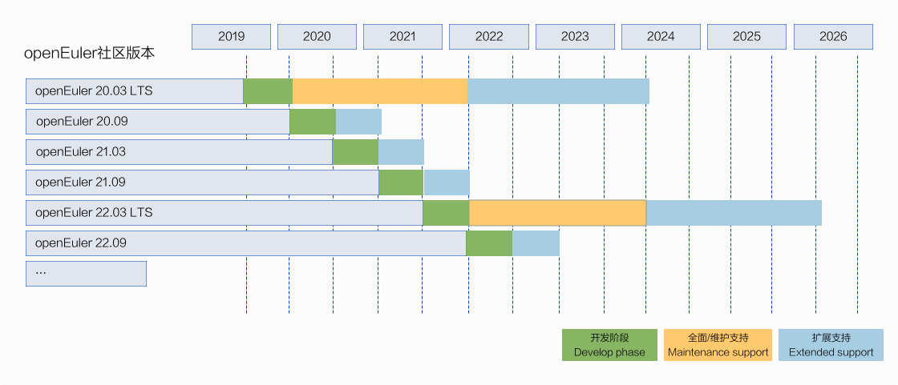

## 1、openEuler社区版本生命周期管理规范（总体）

社区版本按照交付年份和月份进行版本号命名。例如，openEuler 20.09于2020年09月发布。

社区版本分为长期支持版本和创新版本。

- **长期支持版本**：发布间隔周期定为2年，提供4年社区支持。社区首个LTS版本openEuler 20.03 LTS于20年3月发布，基于5.10内核的openEuler 22.03 LTS于22年3月发布。

- **社区创新版本**：openEuler每隔6个月会发布一个社区创新版本，提供6个月社区支持。下一个社区创新版本将于2022年9月发布。

## 2、openEuler社区版本生命周期管理规范（LTS+SP） 
 _* 方案已经在TC和Release SIG汇报，并完成了社区邮件列表公示（2022/3/15~2022/3/31）_ 

- 目前LTS版本**全版本**生命周期4年（ 2+2 ），到生命周期结束前半年~1年由**相关团队组建联合维护团队，申请**延长至6年

- LTS版本SP版本生命周期原则上按照小SP（6月份Release，可选） 9个月，大SP （12月份Release）24个月执行；**大规模使用**建议选择大SP

- SP0**默认执行大SP策略**，可基于社区使用情况和社区规则提前半年~1年审视是否提前结束；SP3作为LTS最后一个SP，随LTS全版本生命周期结束

- Maintenance Support：CVE、Bugfix，新硬件支持和少量新特性（保证LTS内前向兼容的情况）

- Extend Support：修复"主要"以上CVE和Bug

- 单个版本生命周结束前，以邮件和公告的方式提前3个月知会

 
 

-----------------------------
欢迎社区开发者和用户提出宝贵建议，以上规则将根据反馈意见以及社区实施情况不断完善。

