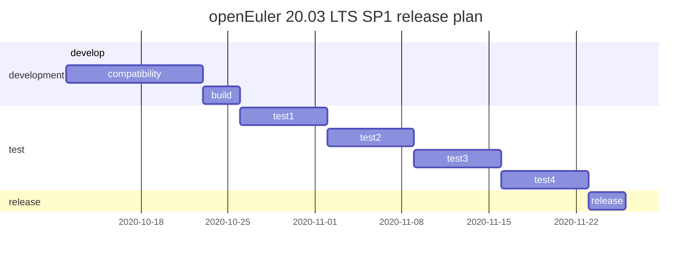

#release plan

```mermaid
	gantt
	dateFormat YYYY-MM-DD
	title openEuler 20.03 LTS SP1 release plan
	section development
	develop       :dev,2020-10-12,2020-11-7
	compatibility :com,after dev,11d
	build         :build,after com,3d
	section test
	test1         :t1,after build,7d
	test2         :t2,after t1,7d
	test3         :t3,after t2,7d
	test4         :t4,after t3,7d
        section release
        release       :after t4,3d
```
