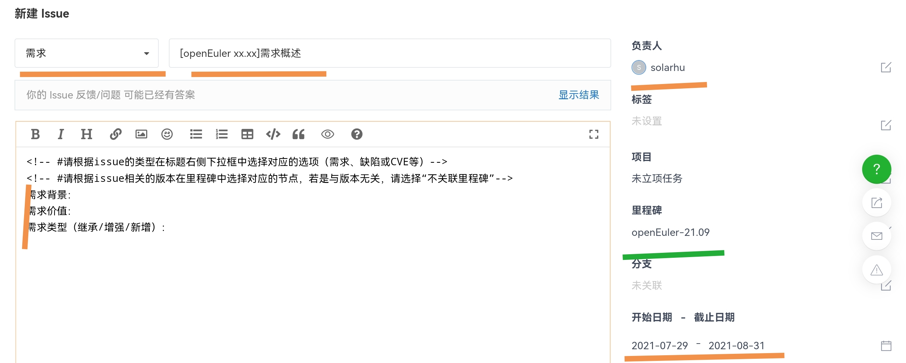
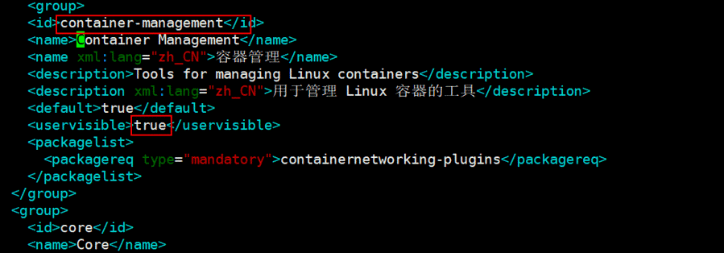
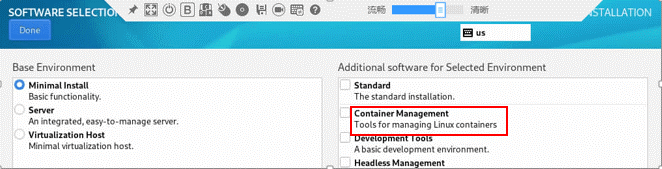
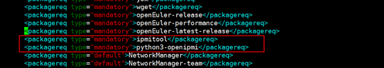

# 一. 创建ISO定制需求issue
在release-management仓库创建需求issue，issue填写格式如下  
绿色部分如果未找到对应的里程碑，可以先不填写

示例：https://gitee.com/openeuler/release-management/issues/I5G4DS

# 二. 提交PR申请合入定制ISO配置文件
以边缘云ISO为例：

1. 提交仓库地址：
https://gitee.com/src-openeuler/oemaker

-   note：注意需要切换到具体的版本分支，例如openEuler-22.09

2. 提交文件：
edge_normal_aarch64.xml
edge_normal_x86_64.xml

示例：
- https://gitee.com/src-openeuler/oemaker/blob/openEuler-22.09/edge_normal_aarch64.xml
- https://gitee.com/src-openeuler/oemaker/blob/openEuler-22.09/edge_normal_x86_64.xml

# 三. @sig maintainer，并推动及时评审，评审通过后才计入版本需求

# 四. normal_{aarch64/x86_64}.xml关键字段解释
在normal.xml中，我们可以看到有很多不同的元素，其中group和environment比较重要。

1. group

    group将软件包按照功能划分了不同的组。注意，当userinvisible为true的时候，该组会默认出现在所有安装模式的子选项中。

    

    可以看到实际安装的过程中，安装模式右侧细分的子选项由一条细线分为两类，上面是安装模式各自指定的group，下面则是所有安装模式通用的group。
    

2. environment

    在environment中可以指定安装模式中安装的group有哪些。这里最小安装会默认安装core组中的包，以及右侧用户可以自选是否安装standard中的包。
    

    Core是最基本的软件包组，所有安装模式都会默认安装。如果用户由于业务需要想要在默认安装时增加一个包，则只需在Core组下增加相应包名，注意type必须为mandatory（default和optional可能会不带入iso中）。这里新增ipmi相关的两个包：
    
    

