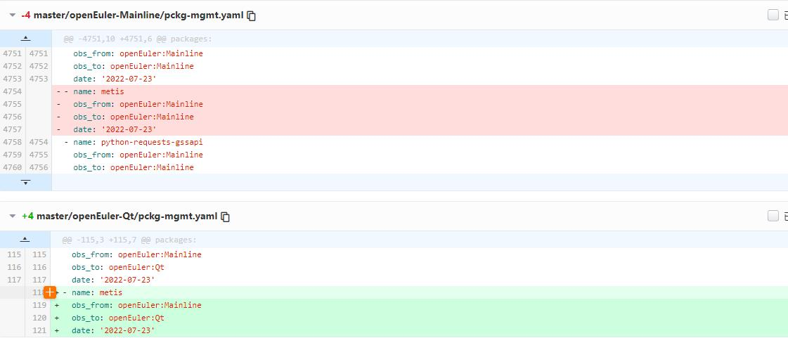
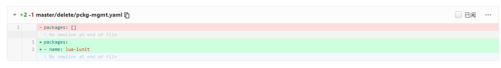
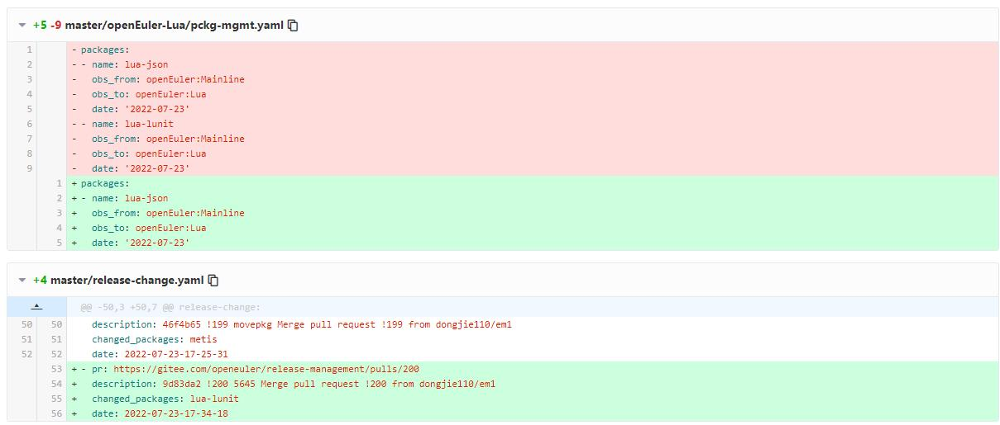
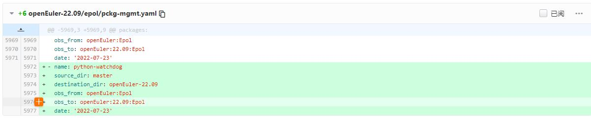
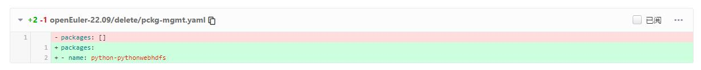
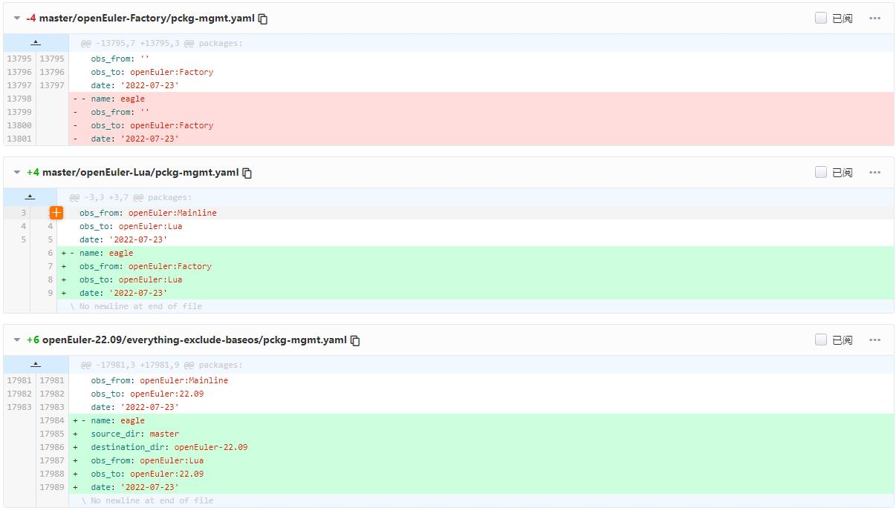

openEuler社区软件包引入到各版本分支原则
1、软件包引入master保护分支，通过tc委员会及对应sig组review、approve即可；
2、软件包从master分支引入到openEuler其他保护分支，需通过tc委员会、对应sig组、以及release managerment sig集体review、approve后可集成到对应版本分支中；

下图简要介绍具体操作流程
！[软件包分支变更权限控制](https://gitee.com/yaqiangchen/release-management/blob/master/Pictures/pckg-mgmt.png)

## 一、创建新软件仓库

新建软件仓库分为两种：新建**原创软件** upstream开源仓库，新引入**其他开源社区开源软件**源码仓库。

### **原创开源软件**，选择openEuler作为upstream托管仓库，对应的PR创建流程如下：

- a) 原创开源软件**加入openEuler社区已有sig组**，提交申请建仓PR，TC 及对应sig组review approve后既可自动创建gitee软件仓（CI脚本自动触发），同时CI脚本会自动触发在OBS的factory编译工程中创建预验证工程；
- PR示例：https://gitee.com/openeuler/community/pulls/1226/files

- b) 原创开源软件**申请新的sig组**，提交申请建仓PR，TC 及对应sig组review approve后既可自动创建gitee软件仓（CI脚本自动触发），同时CI脚本会自动触发在OBS的factory编译工程中创建预验证工程；
- PR示例：https://gitee.com/openeuler/community/pulls/1280/files

### **开源软件引入openEuler社区**，作为openEuler社区版本rebuild构建使用，对应的PR创建流程样例如下：

- a) 开源软件**加入openEuler社区已有sig组**，提交申请建仓PR，TC 及对应sig组review approve后既可自动创建gitee软件仓（CI脚本自动触发），同时CI脚本会自动触发在OBS的factory编译工程中创建预验证工程；
- PR示例：https://gitee.com/openeuler/community/pulls/975/files

- b) 开源软件**申请新的sig组**，提交申请建仓PR，TC 及对应sig组review approve后既可自动创建gitee软件仓（CI脚本自动触发），同时CI脚本会自动触发在OBS的factory编译工程中创建预验证工程；
- PR示例：https://gitee.com/openeuler/community/pulls/1251/files

## 二、代码上传到gitee社区

**建仓**完成后，根据[openEuler社区打包规范](https://gitee.com/openeuler/community/blob/master/zh/contributors/packaging.md),完成软件包spec撰写/适配，之后新建PR提交代码+spec等完整的包文件，通过门禁检查和单包编译检查

- PR示例：https://gitee.com/src-openeuler/isula-build/pulls/1 

## 三、代码编译构建二进制RPM包（OBS构建工程）

在第二步骤中新包在OBS的factory工程下编译成功且稳定后，就可以申请移仓到OBS mainline或者其他master下编译工程中来了，申请PR样例如下（openEuler社区是共主干开发，mainline是不受限新增包，编译成功稳定就可以申请加入mainline或者master下的其他工程，具体可参阅本文第七章节）

- 请参阅本文**第八章/1.1master下包的移动**
- PR示例：https://gitee.com/openeuler/release-management/pulls/835

## 四、纳入master开发主干的每日构建版本ISO中参与版本构建（jenkins构建工程）

申请该包被纳入各个版本开发主干的每日构建ISO交付件构建列表中；openEuler社区每日构建版本ISO文件根据包规模大小有两类：基础ISO（大约2300+ 二进制RPM包规模），全量ISO（everything ISO,大约10000+ 二进制RPM包）；

- 【PR样例】https://gitee.com/src-openeuler/mkeuleros/pulls/91

## 五、提交需求，申请新增软件包纳入release发布版本ISO中正式对外发布

申请该包被纳入各个版本正式release发布的ISO交付件构建列表中，需要在版本分支拉出来之前的需求收集阶段，提需求给release sig，根据openEuler社区质量要求、版本需求接纳原则来评审；

ISO文件根据包规模大小有两类：基础ISO（大约2300+ 二进制RPM包规模），全量ISO（everything ISO,大约10000+ 二进制RPM包）。

- PR示例：https://gitee.com/openeuler/release-management/issues/I1O7RM?from=project-issue

## 六、release版本ISO中参与版本编译、构建申请（OBS/jenkins工程）

需求纳入release版本后，提交PR申请该包纳入release 分支对应的OBS和jenkins编译构建交付件列表

【openEuler分支中软件包增删改PR申请样例】

- 请参阅本文**第七章** **第八章**

【jenkins构建工程PR申请样例】

- PR样例： https://gitee.com/src-openeuler/mkeuleros/pulls/91

## 七、Relese-management目录及pckg-mgmt字段解释

###  纳管master分支

- Note：社区基于master分支工程做的分层project，如无特殊需求，由CICD sig组主导软件包的分层，开发者如往常提交PR至openEuler: Mainline/openEuler:Epol即可。若开发者对于具体软件包的分层有新建议，欢迎提交issue或者邮件交流

| 目录内容                                   | 解释                                                         |
| ------------------------------------------ | ------------------------------------------------------------ |
| delete                                     | 用于管控master下所有删除包，需要删除包时，只需将包名加入delete目录下的pckg-mgmt.yaml中 |
| openEuler-Factory                          | 用于管控openEuler:Factory工程下所有包                        |
| openEuler-Mainline                         | 用于管控openEuler:Mainline工程下所有包，主流用户态组件       |
| openEuler-BaseTools                        | 用于管控openEuler:Epol工程下所有包，包含版本相关的基础信息组件，基础编译工具链组件 |
| openEuler-C                                | 用于管控openEuler:C工程下所有包，编译依赖C编程语言的组件、插件 |
| openEuler-Common_Languages_Dependent_Tools | 用于管控openEuler:Common_Languages_Dependent_Tools工程下所有包，基础编译依赖组件 |
| openEuler-Epol                             | 用于管控openEuler:Epol工程下所有包，多版本用户态组件         |
| openEuler-Erlang                           | 用于管控openEuler:Erlang工程下所有包，编译依赖erlang编程语言的组件、插件 |
| openEuler-Golang                           | 用于管控openEuler:Golang工程下所有包，编译依赖golang编程语言的组件、插件 |
| openEuler-Java                             | 用于管控openEuler:Java工程下所有包，编译依赖java编程语言的组件、插件 |
| openEuler-KernelSpace                      | 用于管控openEuler:KernelSpace工程下所有包，包含内核及内核态组件 |
| openEuler-Lua                              | 用于管控openEuler:Lua工程下所有包，编译依赖lua编程语言的组件、插件 |
| openEuler-Meson                            | 用于管控openEuler:Meson工程下所有包，编译依赖meson编程语言的组件、插件 |
| openEuler-MultiLanguage                    | 用于管控openEuler:MultiLanguage工程下所有包，编译依赖多编程语言的组件、插件 |
| openEuler-Nodejs                           | 用于管控openEuler:Nodejs工程下所有包，编译依赖nodejs编程语言的组件、插件 |
| openEuler-Ocaml                            | 用于管控openEuler:Ocaml工程下所有包，编译依赖ocaml编程语言的组件、插件 |
| openEuler-Perl                             | 用于管控openEuler:Perl工程下所有包，编译依赖perl编程语言的组件、插件 |
| openEuler-Python                           | 用于管控openEuler:python工程下所有包，编译依赖python编程语言的组件、插件 |
| openEuler-Qt                               | 用于管控openEuler:Qt工程下所有包，编译依赖qt编程语言的组件、插件 |
| openEuler-Ruby                             | 用于管控openEuler:Ruby工程下所有包，编译依赖ruby编程语言的组件、插件 |
| release_change.yaml                        | 用于记录所有包变动内容                                       |

### 纳管multi_version分支

| 目录内容                                                     | 解释                                                         |
| ------------------------------------------------------------ | ------------------------------------------------------------ |
| openEuler_22.03_LTS_Epol_Multi-Version_OpenStack_Train       | 用于管控openEuler-22.03-LTS openstack train版本软件包的增加、删除、移动 |
| openEuler_22.03_LTS_Epol_Multi-Version_OpenStack_Wallaby     | 用于管控openEuler-22.03-LTS openstack wallaby版本软件包的增加、删除、移动 |
| openEuler_22.03_LTS_Next_Epol_Multi-Version_OpenStack_Train  | 用于管控openEuler-22.03-LTS-Next openstack train版本软件包的增加、删除、移动 |
| openEuler_22.03_LTS_Next_Epol_Multi-Version_OpenStack_Wallaby | 用于管控openEuler-22.03-LTS-Next wallaby 版本软件包的增加、删除、移动 |

### 纳管版本或开发分支

| 目录内容                  | 解释                                                 |
| ------------------------- | ---------------------------------------------------- |
| baseos                    | 用于管控分支下所有属于baseos包的增加、移动           |
| epol                      | 用于管控该分支下所有属于epol包的增加、移动           |
| everything-exclude-baseos | 用于管控该分支下所有不属于epol和baseos包的增加、移动 |
| delete                    | 用于管控该分支下所有包的删除                         |
| release-change.yaml       | 用于记录该分支下所有包变动内容                       |

### pckg-mgmt.yaml字段解释

| 字段            | 解释                                                         | 是否必填 |
| --------------- | ------------------------------------------------------------ | -------- |
| name            | 包名                                                         | √        |
| source_dir      | 存在于obs_meta仓库的哪个目录(与分支名一样)下                 | ×        |
| destination_dir | 将要复制/新建到obs_meta仓库的哪个目录下                      | ×        |
| obs_from        | 该包来自于OBS工程名，确保该包存在于该工程对应的obs_meta仓库目录(source_dir/obs_from/name)下，否则门禁提示错误 | √        |
| obs_to          | 该包将要新增到的OBS工程名,该包会新增到该工程对应得obs_meta仓库目录(destination_dir/obs_to/name)下 | √        |
| date            | 在yaml中修改该包的日期，修改日期必须与提交日期保持一致，否则门禁会提示错误 | √        |

## 八、开发者提交变更软件包流程

本章节用于指导开发者如何变更release_management下纳管分支(已停维分支除外)对应project内/不同 project之间的软件包

#### 1.1 master下包的移动

<u>***操作实例***：</u>

***<u>修改对应目录下的pckg-mgmt.yaml，从openEuler-Mainline移动metis至openEuler-Qt，将包内容从openEuler-Mainline删除，并添加至openEuler-Qt</u>***

- note：PR合入后自动记录本次PR信息至master/release_change.yaml

#### 1.2 master下包的删除

<u>***操作实例***：</u>

***<u>修改master/delete目录下的pckg-mgmt.yaml，将要删除的包加入到yaml中，无需从原yaml中删除该包信息</u>***

- note：PR合入后自动从原yaml中删除该包，并推送记录本次PR信息至master/release_change.yaml

#### 1.3 master下包的新增

- note：master下包的新增均有后台任务完成，开发者不能操作

#### 1.4 开发或者版本分支下包新增（pckg-mgmt.yaml已拆分）

<u>***操作实例***：</u>

***<u>新增python-watchdog至openEuler-2209/epol中，修改openEuler-2209/epol/pckg-mgmt.yaml，如下图</u>***

- note：PR合入后自动记录本次PR信息至openEuler-2209/release_change.yaml

#### 1.5 开发或者版本分支内包的移动（pckg-mgmt.yaml已拆分）

<u>***操作实例***：</u>

***<u>移动openEuler-2209/epol下的包openapi-schema-validator至openEuler-2209/baseos，如下图修改对应yaml</u>***

note：同分支内包移动， 需从原yaml中删除该包信息，再到目标yaml中添加该包信息，source_dir与destination_dir都为当前分支名，obs_from为该包当前工程名

，obs_to为目标工程名

- note：PR合入后自动记录本次PR信息至openEuler-2209/release_change.yaml中

#### 1.6 开发或者版本分支内包的删除（pckg-mgmt.yaml已拆分）

<u>***操作实例***：</u>

***<u>删除openEuler-2209/everything-exclude-baseos下的python-pythonwebhdfs，将包名写入openEuler-2209/delete/pckg-mgmt.yaml,无需从原yaml中删除该包信息，如下图</u>***

- note：PR合入后自动从原yaml中删除该包信息，并推送本次PR信息至openEuler-2209/release_change.yaml

#### 1.7 一个PR同时提交包移动到两个分支

如果开发者希望在同一个PR中完成：

      (1) 将eagle从openEuler:Factory移动至工程openEuler:Lua;
      (2) 将eagle从openEuler:Lua引入至openEuler-22.09;
- Note：
- 1. 要在同一个PR完成不同分支的包引入或移动，分支需满足以下继承规则:https://gitee.com/openeuler/release-management/blob/master/valid_release_branches.yaml
- 2. 停维分支不支持

***<u>修改对应pckg-mgmt.yaml，如下图</u>***

- Note：PR合入后对于所有包的移动都会自动记录到对应的release_change.yaml

